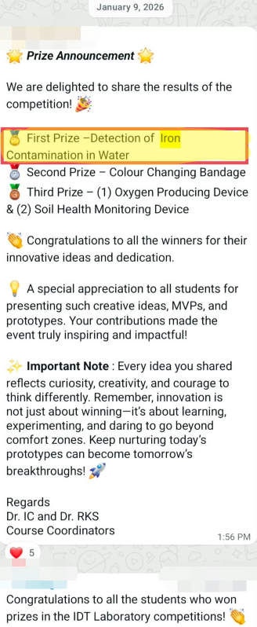

AT

PAT

Bengaluru, India

🥇 1st Place — IDT Showcase

Secured <b>1st Place</b> in the 1st-Semester Innovation & Design Thinking showcase for developing a paper-based colorimetric iron detection kit, featuring a <b>₹500 cash prize</b>.

<a href="/projects/iron-contamination/" style="display: block; text-align: center; background: #0095f6; color: #ffffff; text-decoration: none; font-weight: 600; font-size: 13px; padding: 8px 12px; border-radius: 8px;">
View Project Documentation →
</a>

#Biotechnology #Innovation #DesignThinking #Award

January 9, 2026

